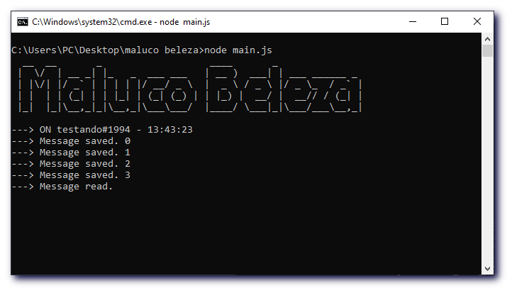
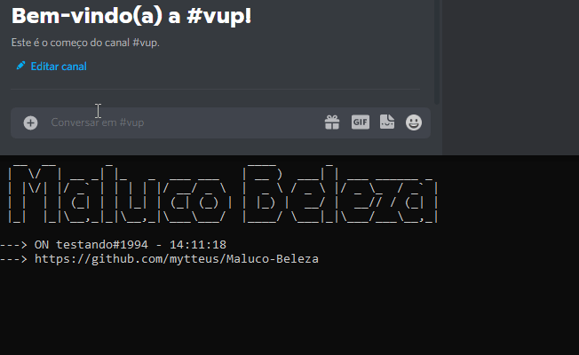

# 🤖 Maluco Beleza
A simple discord.js bot for annotations.

 

## ⚡ Quickstart
1. Clone the repository with `git clone https://github.com/mytteus/Maluco-Beleza/`
2. Open a terminal in folder
3. Type `npm install`
4. Put your TOKEN in code
5. Execute with `node main.js`

## 🏷️ Commands
1. Write with `/write {message}`
2. Read with `/read`

## 👀 Preview

 

## 📚 License
- MIT License.
